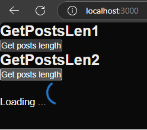
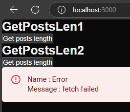
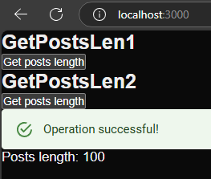

<h1>Project Name</h1>
Generic Server Action Error and Loading Handling in Next.js

<h2 id="project-description">Project Description</h2>
<p>A Next.js project with server actions invoked using a generic custom hook and consumed by a generic component to display loading, error, success, and data.</p>
<p>Compare GetPostsLen1, which does not use the custom hook, and GetPostsLen2, which incorporates the custom hook and generic component, to see the power of this design.</p>


<h2 id="motivation">Motivation</h2>
I want to use <code>useActionState</code> for generic error/loading of server action .However, <code>useActionState</code> currently does not work in Next.js, so I created my simplified version.

<h2 id="installation">Installation</h2>
Use the following command to install the project packages

```bash
pnpm i
```

You can use also npm

<h2 id="usage">Usage</h2>
The following lists the usage of this repository :

<h3>Development server</h3>
Invoke the development server using :

```bash
npm run dev
```

<h3>Logic - using useCustomActionState (GetPostsLen2)</h3>

```tsx
 const { state, run, isPending } = useCustomActionState<number>(
    async () => {
      const length = await fetchPostsLength();
      return length;
    }
  );
```

<h3>UI - using ServerActionStateDefault (GetPostsLen2)</h3>

```tsx
return (
    <div>
      <button onClick={run}>Get posts length</button>
      <ServerActionStateDefault
        isPending={isPending}
        state={state}
        successComponent={
          <div>
            <Alert severity="success">Operation successful!</Alert>
            {<p>Posts length: {state.data}</p>}
          </div>
        }
      />
    </div>
  );
```

<h2 id="demo">Demo</h2>
<p>Invoke the development server and click on the second button</p>
<p><strong>GetPostLen1</strong> is a component that show loading without <code>useCustomActionState</code> and without <code>ServerActionStateDefault</code> \ <code>ServerActionStateGen</code></p>
<p><strong>GetPostLen2</strong> is a component that show loading with <code>useCustomActionState</code> and with <code>ServerActionStateDefault</code> \ <code>ServerActionStateGen</code></p>

<h3>Loading</h3>
Loading indicarion appears for GetPostLen2

<div>

</div>

<h3>Error</h3>
Use <code>BAD_POSTS_URL</code> in the server action <code>fetchPostsLength</code> and you will see error indication for <code>GetPostLen2</code>
<div>

</div>

<h3>Success</h3>
Use <code>GOOD_POSTS_URL</code> in the server action <code>fetchPostsLength</code> and you will see success indication and the data for <code>GetPostLen2</code>
<div>

</div>

<h2 id="design">Design Pros</h2>
This design has few benetits as listed below 

<h3>Flexibility - Separation of Concerns</h3>
<p>
  <strong>Logic:</strong> Invokes the action in a safe and low UI priority manner with <code>useCustomActionState</code>.
</p>
<p>
  <strong>UI:</strong> Displays indicators (error, loading, success) through <code>ServerActionStateDefault</code> and <code>ServerActionStateGen</code>.
</p>

<h3>Flexibility - Handling Also Null Data</h3>
<p>
  Supports data that can be null on success via <code>dataOnSuccessCanBeNull</code> in <code>ServerActionStateGen</code>.
</p>

<h3>Clear Separation of Action States - <code>State&lt;TData&gt;</code></h3>
<p>
  <strong>Error:</strong> Clearly separated to handle failures.
</p>
<p>
  <strong>Data:</strong> Segregated to manage successful responses. (See more details on error handling <a href='#handle-errors'>here</a>).
</p>

<h3>Responsiveness</h3>
<p>
  Server actions are invoked at lower priority using transitions, enhancing responsiveness of input fields.
</p>

<h3>Safety</h3>
<p>
  <code>useCustomActionState</code> manages exceptions in server actions out of the box, ensuring robust error handling.
</p>

<h3>Generality</h3>
<p>
  Utilizes TypeScript interface for Error:
</p>

```ts
  interface Error {
  name: string;
  message: string;
  stack?: string;
}
````

<p>
  This is actually used commonly to throw exceptions:
</p>

````ts
throw new Error("Something went wrong!");
````

<h3>Clarity and Error Prevention</h3>
<p>
  <code>useActionState</code> returns an array <code>[state, formAction, isPending]</code>, while <code>useCustomActionState</code> returns an object <code>{ state, run, isPending }</code>. This approach is clearer and less error-prone.
</p>


<!-- <h2 id="design">Design Pros</h2>
<ol>
  <li>
    Flexibility - Separation of Concerns
    <p>
      <strong>Logic:</strong> Invokes the action in a safe and low UI priority manner with <code>useCustomActionState</code>.
    </p>
    <p>
      <strong>UI:</strong> Displays indicators (error, loading, success) through <code>ServerActionStateDefault</code> and <code>ServerActionStateGen</code>.
    </p>
  </li>
  <li>
    Flexibility - Handling Also Null Data
    <p>
      Supports data that can be null on success via <code>dataOnSuccessCanBeNull</code> in <code>ServerActionStateGen</code>.
    </p>
  </li>
  <li>
    Clear Separation of Action States - <code>State&lt;TData&gt;</code>

  <p>
      <strong>Error:</strong> Clearly separated to handle failures.
    </p>
    <p>
      <strong>Data:</strong> Segregated to manage successful responses. (See more details on error handling <a href='#handle-errors'>here</a>).
    </p>
  </li>
  <li>
    Responsiveness
    <p>
      Server actions are invoked at lower priority using transitions, enhancing responsiveness of input fields.
    </p>
  </li>
  <li>
    Safety
    <p>
      <code>useCustomActionState</code> manages exceptions in server actions out of the box, ensuring robust error handling.
    </p>
  </li>
  <li>
    Generality
    <p>
      Utilizes TypeScript interface for Error :
      
  ```ts
      interface Error {
    name: string;
    message: string;
    stack?: string;
    }
  ```
  
  This is actually used commonly to throw exceptions:

  ```ts
  throw new Error("Something went wrong!");
  ```
  </p>
  </li>
  <li>
    Clarity and Error Prevention
    <p>
      <code>useActionState</code> returns an array <code>[state, formAction, isPending]</code>, while <code>useCustomActionState</code> returns an object <code>{ state, run, isPending }</code>. This approach is clearer and less error-prone.
    </p>
  </li>
</ol> -->


<h2>Code - useCustomActionState</h2>
The following is the code of the custom hooks

```ts
export function useCustomActionState<TData>(
  action: () => Promise<TData>,
  initialState: State<TData>
): [State<TData>, () => void, boolean] {
  const [state, setState] = useState<State<TData>>(initialState);
  const [isPending, startTransition] = useTransition();

  const run = () => {
    startTransition(async () => {
      try {
        const data = await action();
        setState({ data, error: null });
      } catch (error) {
        setState({ data: null, error: error as Error });
      }
    });
  };

  return [state, run, isPending];
}

```
<h3>ui - ServerActionStateGen </h3>
The following is the code of a generic component that show error \ loading \ success indications

```tsx
const ServerActionStateGen: FC<IServerActionStateGen<unknown>> = ({
  isPending,
  state,
  successComponent,
  loadingComponent,
  errorComponent,
  dataOnSuccessCanBeNull
}) => {
  const {error,data} = state;
  if (isPending) return loadingComponent;

  if (error) return errorComponent;
  
  if (!dataOnSuccessCanBeNull && !data) return <></>;

  return successComponent; 
};
```

<h3>ui - ServerActionStateDefault </h3>
The following is the code of a default component that show error \ loading \ success indications using MUI components

```tsx
   const ServerActionStateDefault: FC<IServerActionStateDefault<unknown>> = ({
  isPending,state,successComponent}) => {
  const { error } = state;
  const loadingComponent = <DefaultLoading />;
  const errorComponent = (
    <DefaultError
      name={error?.name ?? ""} message={error?.message ?? ""} stack={error?.stack}/>);
  return (
    <ServerActionStateGen
      successComponent={successComponent}
      errorComponent={errorComponent}
      loadingComponent={loadingComponent}
      isPending={isPending}
      state={state}
      dataOnSuccessCanBeNull={false} // --- by default data on success can not be null
    />
  );
};

```

<h2 id='handle-errors'>How to handle errors in server action</h2>
suppose you have an error in server action - how to handle it ?
<ul>
<li>if your server action throw and error than it is handled out of the box by this design</li>
<li>if your server action fail and return an error inside data - you have two options
<ul>
<li>handle it as data in the ui (in this case data is not only good)</li> 
<li>create a wrapper around your server action and throw exceptions in case of error (in this case data is kept strictly good)</li> 
</ul>
</li>
</ul>


<h2 id="points-of-interest">Points of Interest</h2>
<ul>
    <li>altough the motivation for this repo is server actions the propsed solution can be used for any action not just server. for example ,you can use it e,g, to fetch data on the client</li>
</ul>

<h2 id="references">References</h2>
<ul>
    <li><a href='https://youtu.be/IBZ4esQbKjw?si=XZTIV2mNYLDOVP-w'>Boost React UI Responsiveness with useTransition!</a> - Learn how to use the hook useTransition in 4 minutes</li>
</ul>

